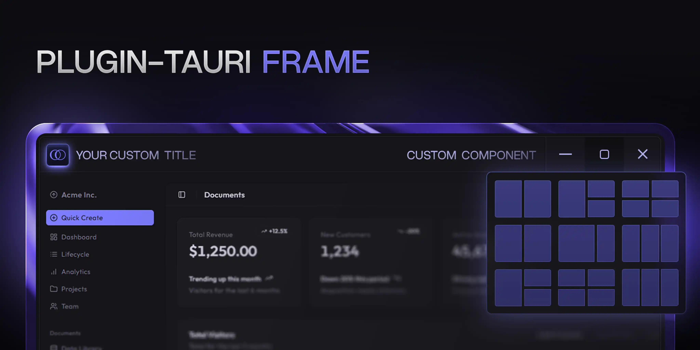

# tauri-plugin-frame

Custom window frame controls for Tauri v2 on Windows. Supports custom titlebars and native Windows 11 Snap Layout hover on custom maximize buttons.

## Platform Support

This plugin is **Windows-only**. On other platforms, all methods are no-ops.

- ✅ **Windows 11**: Custom titlebar plus native Snap Layout menu on maximize hover.
- ✅ **Windows 10**: Custom titlebar support. Snap Layout menu is a Windows 11 shell feature.

## Features

- **Native Windows 11 Snap Layout** - Hover custom maximize button to show Windows snap picker via native `WM_NCHITTEST` / `HTMAXBUTTON`; no keybind or input simulation
- **Custom Overlay Titlebar** - Replace default window decorations with customizable titlebar controls
- **Builder Config** - Configure height, button width, hover colors, and Snap Layout overlay
- **CSS Variable Integration** - Auto-updated `--tauri-frame-controls-width` for responsive header layouts
- **Zero Frontend Code** - Plugin auto-injects titlebar scripts; no JavaScript command required
- **Auto-apply Mode** - Apply titlebar to all windows automatically without per-window setup
- **Lightweight** - Minimal footprint, Windows-only behavior (no-op on other platforms)

## Install

```bash
cargo add tauri-plugin-frame
```

Add to `src-tauri/capabilities/default.json`:
```json
{
  "permissions": [
    "core:window:allow-close",
    "core:window:allow-center",
    "core:window:allow-minimize",
    "core:window:allow-maximize",
    "core:window:allow-set-size",
    "core:window:allow-set-focus",
    "core:window:allow-is-maximized",
    "core:window:allow-start-dragging",
    "core:window:allow-toggle-maximize"
  ]
}
```

No `frame:*` permission is required; plugin exposes no frontend command.

Set in `tauri.conf.json`:
```json
{
  "app": {
    "withGlobalTauri": true,
    "windows": [
      {
        "decorations": false
      }
    ]
  }
}
```

## Usage

### Recommended: Auto-apply to all windows

```rust
use tauri_plugin_frame::FramePluginBuilder;

tauri::Builder::default()
    .plugin(FramePluginBuilder::new().auto_titlebar(true).build())
```

### Alternative: Manual per window

```rust
use tauri::Manager;
use tauri_plugin_frame::WebviewWindowExt;

tauri::Builder::default()
    .plugin(tauri_plugin_frame::init())
    .setup(|app| {
        app.get_webview_window("main").unwrap().create_overlay_titlebar()?;
        Ok(())
    })
```

## Configuration Options

| Option | Default | Description |
|--------|---------|-------------|
| `auto_titlebar(bool)` | `false` | Auto-apply titlebar to all windows |
| `snap_overlay(bool)` | `true` | Enable native Windows 11 Snap Layout hover via hit-test overlay |
| `titlebar_height(u32)` | `32` | Titlebar height in logical pixels |
| `button_width(u32)` | `46` | Window control button width in logical pixels |
| `close_hover_bg(&str)` | `rgba(196,43,28,1)` | Close button hover background color |
| `button_hover_bg(&str)` | `rgba(0,0,0,0.2)` | Minimize/maximize hover background color |

## Methods

| Method | Description |
|--------|-------------|
| `create_overlay_titlebar()` | Apply titlebar with configured height |
| `create_overlay_titlebar_with_height(u32)` | Apply titlebar with custom height |


## Windows 11 Snap Layout

`snap_overlay(true)` installs a small native child HWND over the custom maximize button. The child returns `HTMAXBUTTON` for `WM_NCHITTEST`, which is the Windows-supported path for showing Snap Layout. The plugin does not simulate `Win+Z`, mouse input, or keyboard input.

## CSS Variable

The plugin automatically sets and updates `--tauri-frame-controls-width` CSS variable. This makes it easy to build custom header components that need to avoid overlapping with window controls.

**Why is this useful?**
- Window controls (minimize, maximize, close) overlay on top of your content
- Your custom header/navbar needs padding to avoid being hidden behind these buttons
- The variable auto-updates on window resize, so your layout always stays correct

**Example usage:**

```css
/* Custom header that respects window controls */
.my-header {
  position: fixed;
  top: 0;
  left: 0;
  right: 0;
  height: 32px;
  padding-right: var(--tauri-frame-controls-width, 138px);
}

/* Navigation tabs that don't overlap with controls */
.tabs {
  margin-right: var(--tauri-frame-controls-width, 138px);
}
```

> **Note:** Check the [examples](./examples) folder for a working demo of `--tauri-frame-controls-width` usage.

## CSS Styling

```css
/* Titlebar container */
[data-tauri-frame-tb] {
  background: rgba(0,0,0,0.1);
}

/* Window control buttons */
#frame-tb-minimize,
#frame-tb-maximize,
#frame-tb-close {
  /* your styles */
}
```

## License

MIT - Originally forked from [tauri-plugin-decorum](https://github.com/clearlysid/tauri-plugin-decorum)
